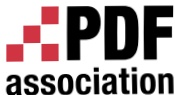
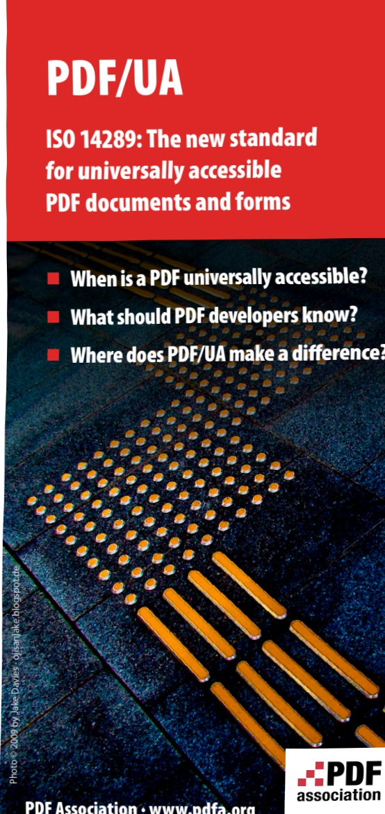

## Creating PDF/UA 

An assertion of PDF/UA conformance places stringent demands on both document authoring software and the author responsible for the conformance status of a particular document. In PDF, text strings of arbitrary lengths may occur in almost any content stream for a wide variety of more-orless unfortunate reasons. Developers can take very little for granted, but PDF/UA ensures a focus on what matters for accessibility purposes. PDF/UA makes it possible to deliver accessible content with the reliability that is a hallmark of PDF.To comply with PDF/UA, all content on the PDF page must be correctly categorized as artifact or real content. All real content must then be correctly characterized in semantic terms and a tags tree provided, to indicate the logical reading order of the document.

High quality input PDF files are required, including several specific technical requirements for font embedding and character encoding, among other requirements.

## Using PDF/UA 

Conformance with ISO 14289 enables a top-quality reading and navigating experience with all types of conforming assistive technology. Organizations can use PDF/UA as part of their overall strategy to comply with applicable accessibility laws, regulations or best practices. PDF/UA enables...

Access to content in a structured, logical reading order complete with applicable semantics 

High-quality results when accessing PDF content on mobile devices, smart-phones, e-readers and tablet PCs 

Text reuse (copy & paste, automated content extraction)Enhanced search results 

Consumers of PDF/UA conforming PDF files include PDF readers, screen readers, magnification and text re-flow tools,Braille printers, text-to-speech (TTS) systems, content reuse and re-purposing implementations as well as search engines.

## The PDF/UA Competence Center 

Within the PDF Association, accessibility experts, PDF developers and supporters of PDF/UA work together in the PDF/UA Competence Center to discuss strategies, develop educational material and research technical implementation details. We identify opportunities to speak at conferences and organize webinars or in-person-events to educate developers, policy makers and end users about PDF/UA.

## Join the PDF/UA Competence Center!

If your organization is already a member of the PDF Association,consider joining the conversation and activities in the PDF Association's PDF/UA Competence Center – just send an email to info@pdfa.org for more information or to sign up right away.

If your organization cannot become a member of the PDF Association you may still join as an individual and become part of the PDF/UA Competence Center's meetings, discussions,public events and development efforts. Again, just send an email to info@pdfa.org for more information.

## Membership in the PDF Association 

Founded in 2006, the PDF Association exists to promote the adoption and implementation of International Standards for PDF technology. The activities of the PDF Association cover the PDF standard itself as well as PDF/A, PDF/E, PDF/UA,PDF/VT and PDF/X. We work closely with ISO on the development of future PDF standards. If you wish to participate in the most influential association for PDF to shape what PDF will look like in the future, please get in touch:

Association for Digital Document 

Standards e.V.

- PDF Association –

Neue Kantstraße 14

14057 Berlin 

Tel: +49 30 39 40 50-0 · Fax: +49 30 39 40 50-99www.pdfa.org · info@pdfa.org · Registered in: Berlin, District Court of Berlin-Charlottenburg, VR 26099 B · VAT ID: DE251189066

