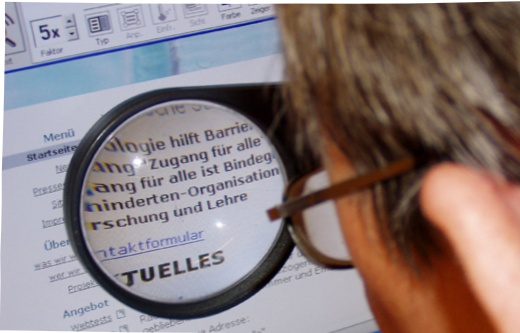

## What is PDF/UA?

PDF/UA is the common name for ISO 14289. An international standard approved in 2012, PDF/UA defines how to represent electronic documents in the PDF format in a manner that allows the file to be accessible. The standard identifies PDF components and properties relevant to this objective and provides requirements and restrictions on the form of their use.

PDF was not originally designed for accessibility; the focus was on providing accurate and reliable on-screen and printed results for page-based content. In 2000 the PDF specification was extended by a mechanism called "tagging"to make it possible to add structure and semantics to page content.PDF/UA defines the correct use of PDF tagging for maximum accessibility.

In parallel with W3C's Web Content Accessibility Guidelines (WCAG 2.0) project, AllM and Adobe Systems started the PDF/UA Committee in 2004 to explore and develop specific technical requirements for accessible PDF. Following the ISO standardization of PDF in 2008, the working document was redrafted to use ISO 32000 and PDF/UA began development towards publication as an ISO standard. In 2010, PDF/UA was accepted as an ISO New Work Item. In 2012, PDF/UA publishes as ISO 14289.

## PDF/UA makes the world a better place 

Increases likelihood that content provided in the PDF format is more accessible to more people than ever before 

Establishes the technical requirements necessary to encourage development of accessible PDF creation and reading software 

Provides an International Standard to guide software procurement and development 

Provides a technically-specific road-map to conformance with WCAG 2.0 in PDF content 

Reduces liability exposure and minimizes legal uncertainty 

Enables high quality, reliable reuse and re-purposing of PDFs 

Implies eligibility for the “A”conformance level of PDF/A, the widely adopted ISO standard for PDF based archiving 

## Why does the world need PDF/UA?

Tagged PDF first entered the market well over a decade ago.Why do we need an ISO standard for this PDF feature?

PDF is highly capable but internally complex. Regarding tagging and content reuse, the core PDF language includes significant ambiguities that have led to confusion and reduced interoperability. Market pressure for a reliable content accessibility and reuse mechanism for PDF content has been building for years, but key public-sector regulations to-date have tended to provide guidance in HTML and web-specific terms, leaving implementers without clear guidance on how to ensure the PDF files they create are made both reliable and accessible in the assistive technology context.

For these and other reasons high-quality tagged PDF has been slow to find broad acceptance. Today, over 70% of PDFs produced on desktop computers are still completely untagged,while those PDFs that are tagged are frequently substandard.As a consequence, most users who rely on tags in PDF to read have learned to dislike PDF files for the unreliable, disjointed and grossly unsatisfactory experience they've so often received.

## PDF/UA delivers enhanced communications to persons with disabilities 

PDF/UA will offer demonstrable high-quality results to end-users with disabilities using readily-available PDF/UA conforming (and near-conforming) readers and assistive technology.

It is to be expected that the PDF/UA standard will soon be referenced by equal access legislation and policies in Europe,North America and elsewhere, whether for government agencies, public procurement regulations or organizations in the private sector.

PDF/UA will quickly become an indispensable building block for any comprehensive organization-wide strategy to ensure documents and forms conform with applicable accessibility regulations, reducing liability exposure.

### PDF/UA is a reality. What are you going to do about it?

PDF/UA is coming soon, and there's something for everyone:

Authoring software used to create PDF files, including OCR software, office programs and publishing tools 

Editing software used to modify or tag existing PDF files 

Reader software used to process a PDF file for use in a viewer or other consumer implementation 

Assistive Technology software used interactively with PDF readers to provide access to users with disabilities 

PDF/UA may soon be a requirement – or a "suggestion" – for your organization or its customers. It's time to know more.

## How can we help?

Members and non-members alike will always find the PDF Association website, www.pdfa.org, a good place to start.The organization has made available video recordings and slides of technical presentations regarding PDF/UA from the PDF Association's 2012 Technical Conference. Members of the PDF Association benefit from a network of renowned experts,extensive internal resources and active collaboration in the PDF/UA Competence Center.

